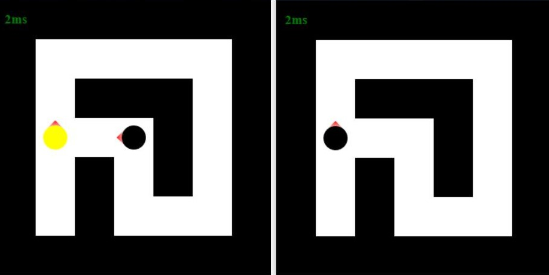

# Shoots
2D Overlooking Shooting Game

using [tornado](https://github.com/tornadoweb/tornado) framework to handle communication, all game communication using websocket.  
using canvas to display.     
having CFR trained AI enemy. [here](https://github.com/lyh-ADT/Shoots/tree/master/Shoots/bin/ai)



## Stucture
```
- Shoots
    - bin # source code
        - server
            - index.html
            - server.py
        - info.py
        - map_builder.py
        - map.py
        - shooter.py
        - shoots.py
    - test # uinttest file
        - map_builder.py
        - shooter.py
- .gitignore
- LICENSE
- README.md
```

## Install
Python3 with tornado, all you need is file in `bin` folder.  
Keep the project structure when you download or just clone the whole repo.Cause the importing depend on the path.

## Usage
run the command below in the root of project
```
python -u -m Shoots.bin.server.server
```
access <http://localhost:9999/> to start the game.

```
 w
asd to move

 ↑
←↓→ to chang facing

Space to shoot
```
